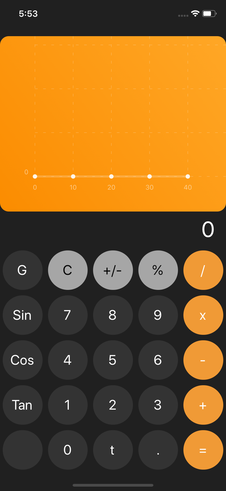
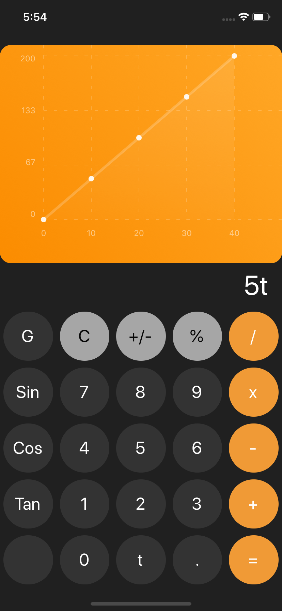

# Graphing Calculator
`Graphing Calculator` is a visualizer for simple single variable arthmetic equation.
 * Simple arthmetic calculation
 * Geometric functions such as sin, cos, and tan
 * Graphical Representation 

  
  
  

  
 <pre>    (A)Inital State                     (B) Graph Mode               (C) Displaying equation   </pre>

Installation
---
_**Prerequisites**_  
In order for you to run this code, you need to first install expo
`https://expo.io/tools`

_**Download Repository**_  
`git clone https://github.com/KLin-18/Calculator.git`

_**Running Application**_  
`Expo Start`

Packages
---
_React-Native-Chart-Kit_
 
https://www.npmjs.com/package/react-native-chart-kit

